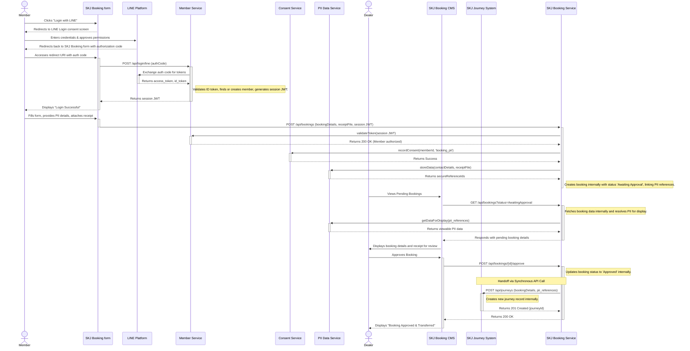

```mermaid
sequenceDiagram
    actor Member
    participant SKJ Booking form
    participant LINE Platform
    participant Member Service
    participant Consent Service
    participant PII Data Service
    actor Dealer
    participant SKJ Booking CMS
    participant SKJ Journey System

    %% --- Member Login via LINE ---
    Member->>+SKJ Booking form: Clicks "Login with LINE"
    SKJ Booking form-->>Member: Redirects to LINE Login consent screen
    
    Member->>+LINE Platform: Enters credentials & approves permissions
    LINE Platform-->>Member: Redirects back to SKJ Booking form with authorization code
    
    Member->>+SKJ Booking form: Accesses redirect URI with auth code
    SKJ Booking form->>+Member Service: POST /api/login/line (authCode)
    
    activate Member Service
    Member Service->>+LINE Platform: Exchange auth code for tokens
    LINE Platform-->>-Member Service: Returns access_token, id_token
    
    Note right of Member Service: Validates ID token, finds or creates member, generates session JWT.
    
    Member Service-->>-SKJ Booking form: Returns session JWT
    deactivate Member Service
    SKJ Booking form-->>-Member: Displays "Login Successful"
    
    %% --- Booking Submission by Logged-in Member ---
    Member->>+SKJ Booking form: Fills form, provides PII details, attaches receipt
    SKJ Booking form->>+SKJ Booking Service: POST /api/bookings (bookingDetails, receiptFile, session JWT)
    deactivate SKJ Booking form
    
    activate SKJ Booking Service
    
    %% --- Validation and Secure Data Handling ---
    SKJ Booking Service->>+Member Service: validateToken(session JWT)
    Member Service-->>-SKJ Booking Service: Returns 200 OK (Member authorized)
    
    SKJ Booking Service->>+Consent Service: recordConsent(memberId, 'booking_pii')
    Consent Service-->>-SKJ Booking Service: Returns Success
    
    SKJ Booking Service->>+PII Data Service: storeData(contactDetails, receiptFile)
    PII Data Service-->>-SKJ Booking Service: Returns secureReferenceIds
    
    Note right of SKJ Booking Service: Creates booking internally with status 'Awaiting Approval', linking PII references.
    deactivate SKJ Booking Service

    %% --- Dealer Approval Sub-flow ---
    Dealer->>+SKJ Booking CMS: Views Pending Bookings
    SKJ Booking CMS->>+SKJ Booking Service: GET /api/bookings?status=AwaitingApproval
    
    activate SKJ Booking Service
    Note right of SKJ Booking Service: Fetches booking data internally and resolves PII for display.
    SKJ Booking Service->>+PII Data Service: getDataForDisplay(pii_references)
    PII Data Service-->>-SKJ Booking Service: Returns viewable PII data
    SKJ Booking Service-->>-SKJ Booking CMS: Responds with pending booking details
    deactivate SKJ Booking Service
    
    SKJ Booking CMS->>Dealer: Displays booking details and receipt for review
    Dealer->>+SKJ Booking CMS: Approves Booking
    SKJ Booking CMS->>+SKJ Booking Service: POST /api/bookings/{id}/approve
    
    activate SKJ Booking Service
    Note right of SKJ Booking Service: Updates booking status to 'Approved' internally.
    
    %% --- Handoff to Journey System via API---
    Note over SKJ Booking Service, SKJ Journey System: Handoff via Synchronous API Call
    SKJ Booking Service->>+SKJ Journey System: POST /api/journeys (bookingDetails, pii_references)
    activate SKJ Journey System
    Note right of SKJ Journey System: Creates new journey record internally.
    SKJ Journey System-->>-SKJ Booking Service: Returns 201 Created (journeyId)
    deactivate SKJ Journey System
    
    SKJ Booking Service-->>-SKJ Booking CMS: Returns 200 OK
    deactivate SKJ Booking Service
    SKJ Booking CMS-->>-Dealer: Displays "Booking Approved & Transferred"

```

