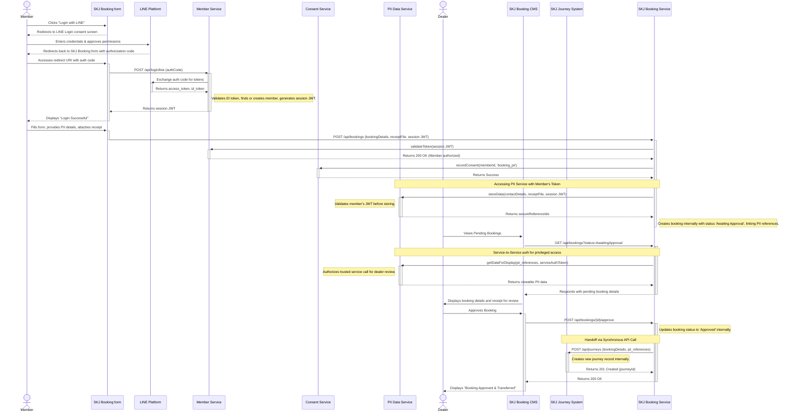

summary of the roles for each system and component
| System/Component | Primary Role & Responsibilities |
|---|---|
| Member Service | Manages member profiles (CRUD), handles user authentication (including social login via LINE Platform), validates session tokens, and manages authorization. |
| SKJ Booking Service | Orchestrates the entire car booking process from initiation until dealer approval. It validates user requests and coordinates with the Member, PII, and Consent services. |
| PII Data Service | Acts as a secure vault for all Personally Identifiable Information (PII) like contact details and payment receipts. Enforces strict, token-based access controls for all data requests. |
| Consent Service | Manages and provides an audit trail for user consent. It is called whenever an action requires explicit permission from the member to process their data. |
| SKJ Journey System | Manages the post-approval customer lifecycle. It receives approved booking details from the Booking Service and handles subsequent steps like quotation, payment, and delivery. |
| SKJ Booking form (Frontend) | The user interface for members to log in, manage their profile, and create car bookings. It renders the form and communicates with the various backend APIs. |
| SKJ Booking CMS | The internal admin portal for dealership staff. It allows authorized dealers to view pending bookings, review customer-provided details, and approve transactions. |
| LINE Platform | An external identity provider responsible for authenticating users via their LINE account during the social login process. |

