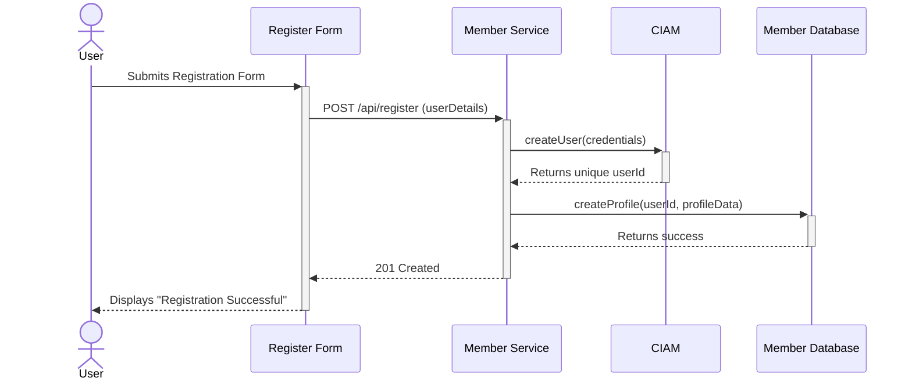

```mermaid
sequenceDiagram
    actor User
    participant Register Form
    participant Member Service
    participant CIAM
    participant Member Database

    User->>+Register Form: Submits Registration Form
    Register Form->>+Member Service: POST /api/register (userDetails)
    Member Service->>+CIAM: createUser(credentials)
    CIAM-->>-Member Service: Returns unique userId
    Member Service->>+Member Database: createProfile(userId, profileData)
    Member Database-->>-Member Service: Returns success
    Member Service-->>-Register Form: 201 Created
    Register Form-->>-User: Displays "Registration Successful"
```
