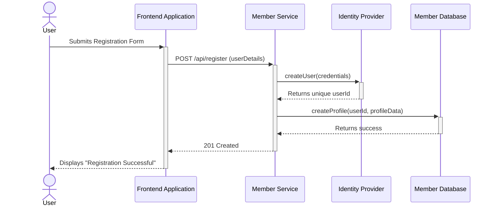

```mermaid
sequenceDiagram
    actor User
    participant Frontend Application
    participant Member Service
    participant Identity Provider
    participant Member Database

    User->>+Frontend Application: Submits Registration Form
    Frontend Application->>+Member Service: POST /api/register (userDetails)
    Member Service->>+Identity Provider: createUser(credentials)
    Identity Provider-->>-Member Service: Returns unique userId
    Member Service->>+Member Database: createProfile(userId, profileData)
    Member Database-->>-Member Service: Returns success
    Member Service-->>-Frontend Application: 201 Created
    Frontend Application-->>-User: Displays "Registration Successful"
```
